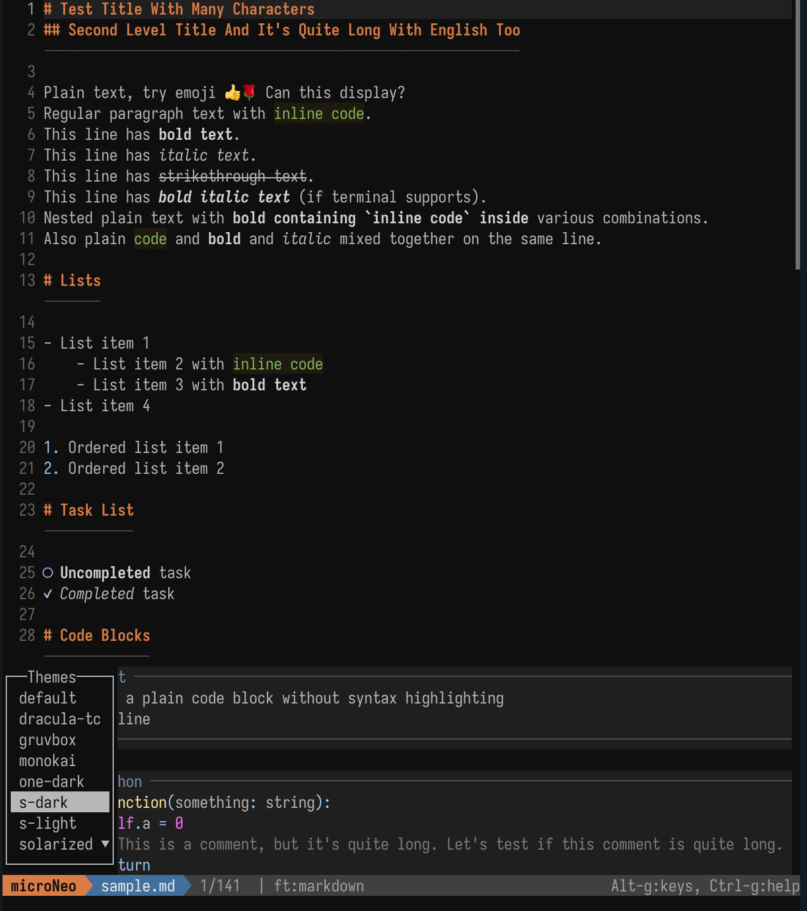
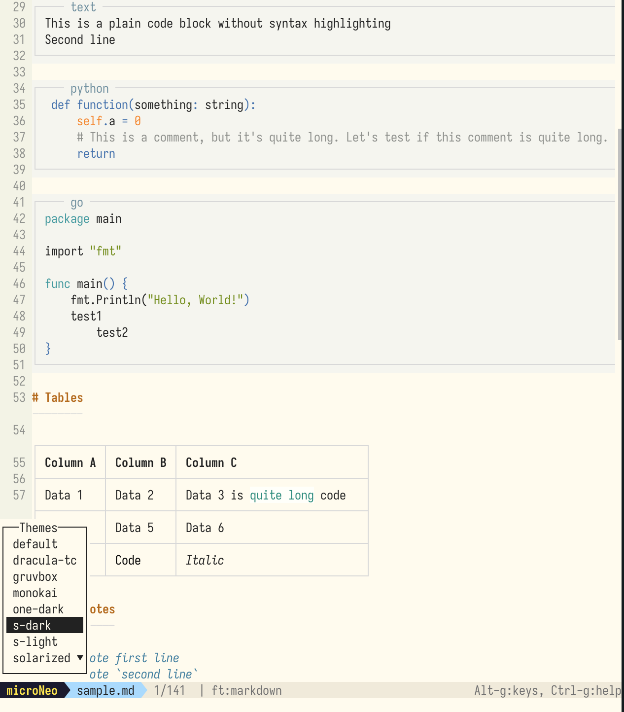

#  microNeo -- AI Partner

[](./LICENSE)
[](https://golang.org/)
[]()
[](https://github.com/rothgar/awesome-tuis)
[](https://sollawen.github.io/microNeo/)

## The terminal editor that can discuss with AI agents

Since vibe coding, I write code by hand less and less, and spend more and more time discussing with the AI. I always need to tell the AI exactly which part of a document I have thoughts about. I have to ctrl-c/ctrl-v all day long — it's given my fingers tendonitis.

So here comes **microNeo, an AI Partner**.

- Open a markdown document with microNeo and select the text you want to comment on
- Press `alt-enter` to open the input box, and write down your thoughts
- Press `alt-enter` again to send it to the AI. The AI will then receive your comment.

[](https://sollawen.github.io/microNeo/)

Currently supports `pi`, `opencode`, and `claude cli`. However, since `claude cli` is not open source, it works but isn't perfect.

---

## One-line Install

```bash
curl -fsSL https://raw.githubusercontent.com/sollawen/microNeo/master/tools/install.sh | sh
```

- Fully supported on Linux/Mac. Windows requires a terminal command-line environment; not tested yet.
- See [Quick Start](https://sollawen.github.io/microNeo/en/quick-start/) for how to use microNeo.
- 具体使用说明见 [Quick Start](https://sollawen.github.io/microNeo/quick-start/) 

**国内用户**, 如果出现 `raw.githubusercontent.com` is rate-limited (HTTP 429) or unreachable 的问题，可以使用下面的这个镜像来一句话下载。这个问题通常是由于VPN使用的IP地址被GitHub限流了。

```bash
curl -fsSL https://cdn.jsdelivr.net/gh/sollawen/microNeo@master/tools/install.sh | sh
```

---

## File Manager

I don't like the `cd` command — navigating across multi-level directories is really cumbersome. I also don't like installing a bunch of tools on the system and then jumping back and forth between them. So I built a fairly complete and lightweight Finder inside microNeo — one place where I can switch directories, find files, and open them for editing all in one go.

**How to Open the Finder**

Run microNeo without a filename argument to automatically open the Finder:
```
microneo
```

If you run microNeo with a filename argument, it goes straight into the editor without opening the Finder:
```
microneo README.md
```

And you can press `ctrl-q` while you are editing some file to open the Finder.

{ width="70%" }

---

## Multi-file Editing

microNeo can edit multiple files at the same time.

### Open Files in a New Tab

While editing file A, if you also want to open file B, press `ctrl-t` to open a new tab. Then, in that tab's File Manager, pick the file you want to open for editing.

<div class="image-pair" markdown>


</div>

### Keyboard Shortcuts with Multiple Files

- `alt--` (alt + minus) -> Shrink the area occupied by the current file
- `alt-=` (alt + equals) -> Grow the area occupied by the current file
- `alt-9` -> Switch to the tab on the left
- `alt-0` -> Switch to the tab on the right

### Other Operations

- Tab labels can be clicked with the mouse.
- `ctrl-q` opens the File Manager. Pressing `ctrl-q` (or `q`) again inside the File Manager actually closes the current file.

---

## Theme

microNeo supports a variety of color themes. Users can also customize their own.
- In the main editor view, press `ctrl-e` to enter the InfoBar at the bottom.
- Then type the command `theme` and press Enter to choose a different theme.

<div class="image-pair" markdown>


</div>


## Features

- Full-featured terminal editor with syntax highlighting for 100+ languages 
- Communicate with AI agents to send your thoughts to the AI. Supports multiple AI agents.
- Markdown real-time rendering in the same window — comfortable for reading AI-written plan documents.
- Mouse support. Shortcuts are similar to VS Code.
- Multiple themes, including dark and light mode.
- Small and fast — only 13 MB.


## Configuration

For more configuration options, see https://sollawen.github.io/microNeo/

---


**Relationship with Micro**

microNeo originated from [Micro](https://github.com/micro-editor/micro). The codebase inherits Micro's editor architecture (zero dependencies, intuitive operation, Lua plugins, mouse support) and adds many features for vibe coding on top of it.

microNeo is now developed independently, with the goal of becoming the best AI agent partner in the terminal.


**License** -- [MIT](./LICENSE)

---

Email: sollawen@gmail.com
