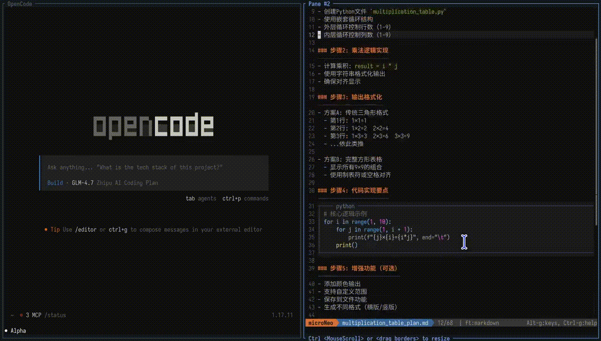

#  microNeo -- AI Partner

[](./LICENSE)
[](https://golang.org/)
[]()
[](https://github.com/rothgar/awesome-tuis)
[](https://sollawen.github.io/microNeo/)

## The terminal editor that can discuss with AI agents

Since vibe coding, I write code by hand less and less, and spend more and more time discussing with the AI. I always need to tell the AI exactly which part of a document I have thoughts about. I have to ctrl-c/ctrl-v all day long — it's given my fingers tendonitis.

So here comes **microNeo, an AI Partner**.

- Open a markdown document with microNeo and select the text you want to comment on
- Press `alt-enter` to open the input box, and write down your thoughts
- Press `alt-enter` again to send it to the AI. The AI will then receive your comment.

[](https://sollawen.github.io/microNeo/)

Currently supports `pi` and `opencode`; support for `claude cli` is under development.

---

## One-line Install

```bash
curl -fsSL https://raw.githubusercontent.com/sollawen/microNeo/master/tools/install.sh | sh
```

- Fully supported on Linux/Mac. Windows requires a terminal command-line environment; not tested yet.
- See [Quick Start](https://sollawen.github.io/microNeo/en/quick-start/) for how to use microNeo.

---

## Features

- Full-featured terminal editor with syntax highlighting for 100+ languages 
- Communicate with AI agents to send your thoughts to the AI. Supports multiple AI agents.
- Markdown real-time rendering in the same window — comfortable for reading AI-written plan documents.
- Mouse support. Shortcuts are similar to VS Code.
- Small and fast — only 13 MB.


---


**Relationship with Micro**

microNeo originated from [Micro](https://github.com/micro-editor/micro). The codebase inherits Micro's editor architecture (zero dependencies, intuitive operation, Lua plugins, mouse support) and adds many features for vibe coding on top of it.

microNeo is now developed independently, with the goal of becoming the best AI agent partner in the terminal.


**License** -- [MIT](./LICENSE)

---

Email: sollawen@gmail.com
