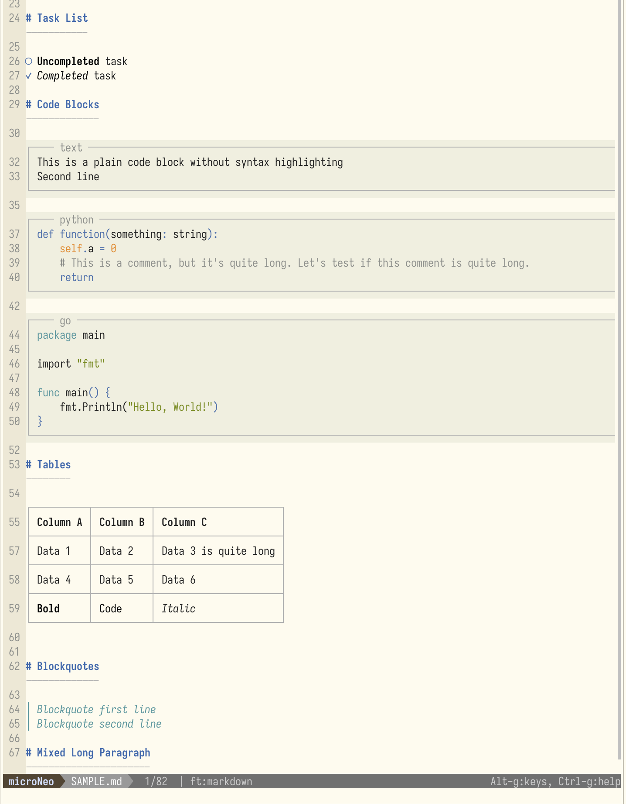

<div align="center">


---

***The AI era is coming — less code, more Markdown.***

**A Terminal Markdown Editor — View and edit, together.**

[](./LICENSE)

<!--
Keywords: terminal-editor, markdown-editor, markdown-preview, markdown-viewer, tui-editor, vim-alternative, nano-alternative, command-line, golang, micro-editor
-->

</div>

---

microNeo is a terminal text editor, evolved from [Micro](https://github.com/micro-editor/micro). It is a full-featured Micro with **real-time rich rendering** for Markdown files.

Open a file, **Click, then edit, that's simple.**

---



## 1. Why microNeo

### Difference from Heavy Editors

vim, emacs, VSCode — they're great for writing code. But in the AI era, fewer people actually write code themselves. Most of the time is spent reviewing AI-generated plans, documents, and reports (*the markdown files*). **Reading code is too boring**.

A heavy editor built for writing code, loaded with dozens of plugins to render Markdown — it's like driving a truck to buy groceries. Most people will become those who only read Markdown, only write Markdown. **What you need is just a Markdown editor**.

### Difference from Lightweight Editors

Micro is an excellent lightweight terminal editor, but it only displays raw Markdown text — tables are cramped, `**` `#` `` ` `` are everywhere. nano is the same.

microNeo adds a Markdown rendering layer on top of Micro: open the same file, and you see the rendered result immediately. No need to quit the editor to check the rendered output.

### Difference from Markdown Viewers

glow and leaf are excellent Markdown viewers, but they **can only read, not edit**. Want to change a row in a table? Exit viewer → open editor → edit → exit → open viewer again to confirm. microNeo eliminates this cycle — reading and editing happen in the same interface.

### Difference from other Markdown Editors

Most Markdown editors — whether terminal or GUI — **split the screen in two**: source on the left, preview on the right. Terminal screens aren't wide to begin with, splitting makes it worse. 

microNeo works differently: **editing and rendering in one window**. You see rendered beautiful output; **click then edit** — no split panes, no wasted space.

### Summary

| | microNeo | Micro / nano | glow / leaf | vim + plugins | GUI Editors |
|--|:---------:|:-------------:|:------------:|:------------:|:-------------:|
| **Editable** | ✅ | ✅ | ❌ | ✅ | ✅ |
| **Markdown Rendering** | ✅ | ❌ | ✅ | ✅ | ✅ |
| **Same Interface** | ✅ | — | — | ❌ (split) | ❌ (split) |
| **Low Learning Curve** | ✅ | ✅ | ✅ | ❌ | ✅ |

## 2. Installation

### One-line Install

```bash
curl -fsSL https://raw.githubusercontent.com/sollawen/microNeo/main/install.sh | sh
```

### Build from Source

Requires Go 1.19 or higher:

```bash
git clone https://github.com/sollawen/microNeo.git
cd microNeo
make build
sudo mv microneo /usr/local/bin
```

- Use `make build` to compile, not `go build` directly. 
- For quick builds that skip the generate step, use `make build-quick`.

### Configuration Files

microNeo uses `$XDG_CONFIG_HOME/microNeo/` for config (defaults to `~/.config/microNeo/`), separate from Micro's original `~/.config/micro/`.

## 3. Usage

```bash
# Open any file
microneo README.md
```

### Set as Default Editor

Add to your shell profile (`~/.bashrc`, `~/.zshrc`, etc.):

```bash
export EDITOR=microneo
```

This allows microNeo to work seamlessly with other tools:

- **Claude Code / OpenCode / Pi** — uses `$EDITOR` for file editing
- **Yazi** — opens files with `$EDITOR` on Enter


## Hotkeys

| Action | Shortcut | Action | Shortcut | Action | Shortcut |
|--------|----------|--------|----------|--------|----------|
| Save | `Ctrl-S` | Undo | `Ctrl-Z` | Command Mode | `Ctrl-E` |
| Quit | `Ctrl-Q` | Search | `Ctrl-F` | | |
| Copy | `Ctrl-C` | Paste | `Ctrl-V` | | |

For more shortcuts and commands, press `Ctrl-E` and type `help` to view built-in help.

## 4. Customization

microNeo's Markdown rendering colors can be customized via color schemes. Use the `md-` prefix in your colorscheme file:

```
# Format: "foreground,background"
color-link md-header      "#CC8242,#242424"
color-link md-bold        "##6A8759,#242424"
color-link md-italic      "#CCCCCC,#242424"
color-link md-blockquote  "#CC8242,#242424"
color-link md-codeblock   "#CCCCCC,#242424"
color-link md-frame       "#505050,#242424"
color-link md-frame-label "#909090,#242424"
color-link md-list        "#CC8242,#242424"
color-link md-link        "#7A9EC2,#242424"
color-link md-hr           "#CC8242,#242424"
```

Built-in color schemes (darcula, gruvbox-tc, etc.) include these definitions. Custom color schemes go in `~/.config/microNeo/colorschemes/`.

## 5. Relationship with Micro

microNeo is an independent fork of [Micro](https://github.com/micro-editor/micro). Micro is an excellent terminal editor — zero dependencies, intuitive operation, Lua plugins, mouse support. microNeo inherits all these strengths, and adds a Markdown rendering pipeline on top.

microNeo aims to develop independently — like NeoVim to Vim — to fundamentally improve the Markdown experience in the terminal.

## 6. License

[MIT](./LICENSE)
