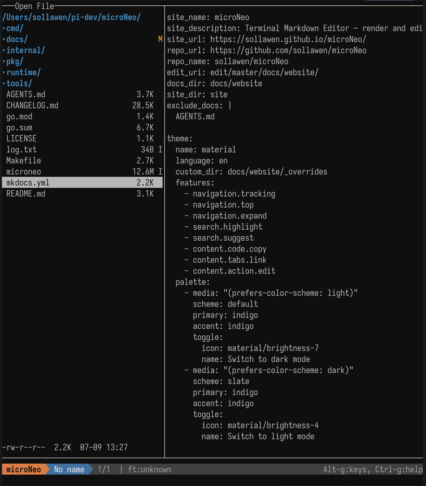

我觉得Linux里面的cd命令实在是太难用了。而且我不喜欢在系统里装一堆工具，然后在工具软件里跳来跳去的。所以我在microNeo里面开发了一个比较完整和小巧的Finder，这样我就可以切换目录、找到文件、打开编辑全套动作一气呵成了。

## 打开Finder的方法

用不带文件名参数的方式来运行microNeo，就会自动打开Finder：
```
microneo
```

如果使用带文件名参数的方式来运行microNeo，就会直接进入编辑界面，不打开Finder
```
microneo README.md
```

{ width="70%" }

## 编辑中打开Finder

如果已经在编辑界面里面了，也可以随时打开Finder，去切换不同的目录并打开新的文件
- 按 `ctrl-q` 退出当前文件，打开Finder，去编辑其它文件
- 按 `ctrl-o` 也可以打开Finder，以后是否保留，待思考

## 显示隐藏文件

Finder缺省是不显示隐藏文件的。在Finder界面里按 `.` 键可打开/关闭隐藏文件的显示

## 文件操作
- `r` 键 -> Rename
- `d` 键 -> Delete
- `a` 键 -> Add，
	- 如果输入的名字以"/"结尾，就是创建新的子目录
	- 如果输入的名字不是"/"结尾，就是创建一个新的文件

暂时不支持copy, move等文件操作。因为我觉得microNeo本质是个方便的Editor。太复杂的文件操作还是交给操作系统或是专门的软件比较合适。

## git 标志
Finder会在目录和文件的右边，显示当前的git状态标志。

```
U -> Untrack, M -> Modified, D -> Deleted, I -> gitignored
```

## 其它功能

- Finder支持鼠标操作
- 如果是文本文件或是程序代码文件，则右边显示预览


## 代替shell里的 cd 命令

- Linux/Mac 系统的 `cd` 命令在多层目录的时候实在是太难用了
- 所以microNeo学习了yazi的方法，可以在fileManager里面切换目录。退出microNeo的时候自动把当前目录切换到最后的文件的所在目录里

**具体使用方法**

在zshrc/bashrc里面添加下面的代码：
```zsh
function m() {
    local tmp="$(mktemp -t "microneo-cwd.XXXXXX")" cwd
    command microneo "$@" --cwd-file="$tmp"
    IFS= read -r -d '' cwd < "$tmp"
    [ "$cwd" != "$PWD" ] && [ -d "$cwd" ] && builtin cd -- "$cwd"
    rm -f -- "$tmp"
}
```

然后直接在shell命令里使用 `m` 命令打开microNeo，选择编辑某个文件。退出后系统目录就自动切换为文件的所在目录了
