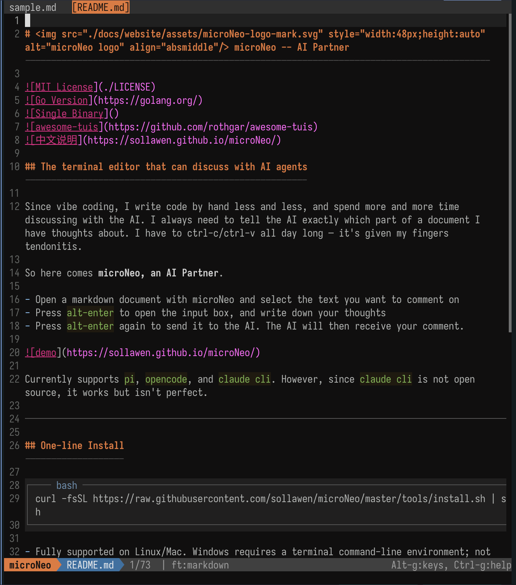
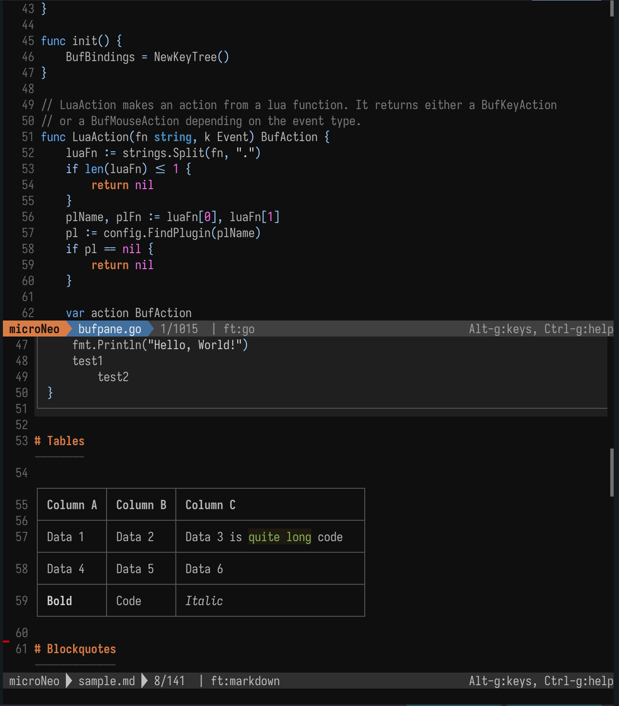

microNeo可以同时编辑多个文件。

## 在新tab标签页中打开文件

当正在编辑一个文件A时候，想同时打开文件B，可以按 `ctrl-t` 打开一个新的tab。然后在新tab里的FileManager里面选择你想打开的文件进行编辑

## 多文件时的快捷键

- `alt--` (alt 减号) -> 减少当前文件占用的区域面积
- `alt-=` (alt 等号) -> 增加当前文件占用的区域面积
- `alt-9` -> 切换到左边那个tab页
- `alt-0` -> 切换到右边那个tab页

## 其它操作

- 支持用鼠标点击tab标签
- `ctrl-q` 打开FineManager。在FileManager里面再次按 `ctrl-q` 或者 `q` 就真的关闭当前文件了

